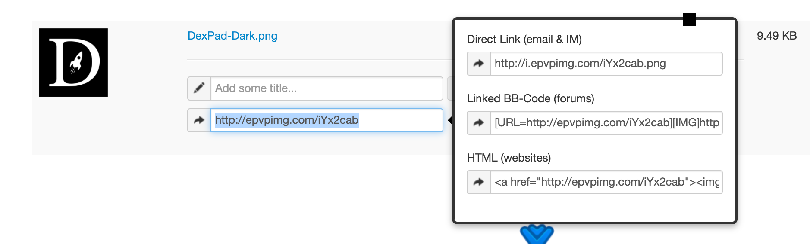

# Token's Logo is not showing up

\*\*Logos need to be image URLS that end in .png, .jpg, .jpeg, or .gif file extensions.

Logos should be at max in 256x256 file dimensions.\*\*

Example [http://i.epvpimg.com/iYx2cab.png](http://i.epvpimg.com/iYx2cab.png)

**If URLS don't end in the correct file extension they will not load!**

I can recommend you this service, there you get the possibility to choose the "direct link"



