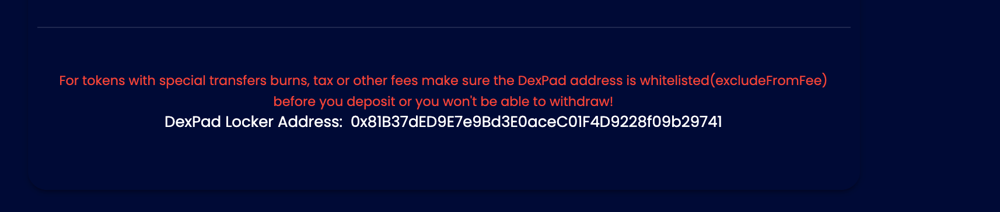

# I can't unlock my locked tokens

## Deactivating Fees? Whitelisting Addresses?

If your contract has "on-transfer" fees it is obvious that your token transfer caused the locker to pay some fees, this causes now the fact, that the Locker has insufficient Tokens to give back to you.

_So - you can't withdraw it._

**Send as much as needed tokens to the locker to fill up the required amount.**

## Still doesn't work?

**So the 2nd most occurring problem is that people set their "MaximumTransactionAmount" too low, which actually blocks then the transfers from the locker to you.**

Simply go to your Contract and increase this Limit :\)

