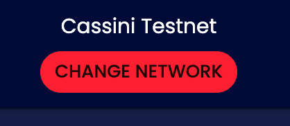
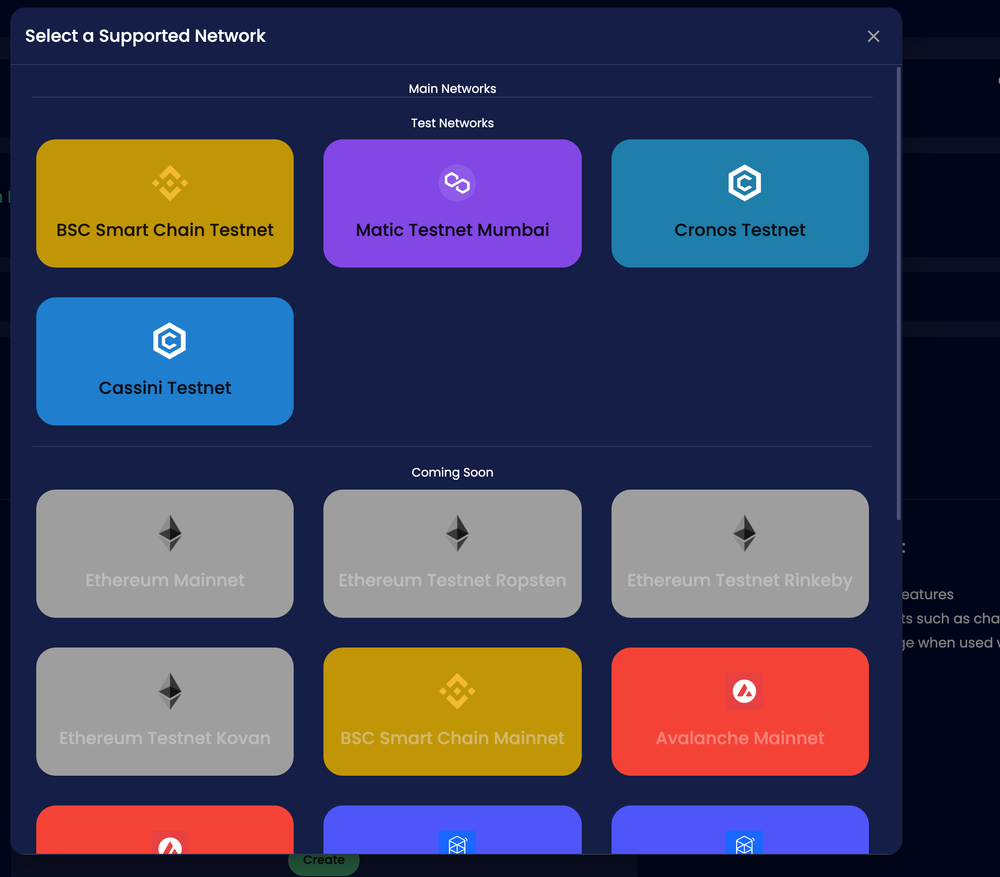
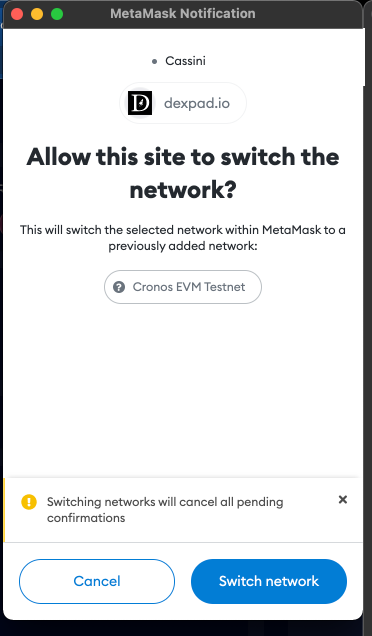

# Selecting a Network

## Wallet

For using our Platform we recommend you to choose a good wallet:

* MetaMask [https://metamask.io/](https://metamask.io/)

## Switching Network

**To switch to the Network of your Choice you can use our Button on the website:**

**By Clicking on the selected Chain there will be a request to change the chain on your Wallet.**

**Then you just gotta confirm this prompt, to change the Network.**

