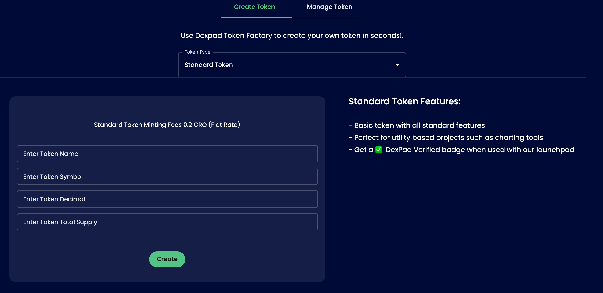

# Standard Token

* ️Most ideal for utility.
* No extra functions like transaction tax
* Basic Send/Approve/Allowance Contract  
* An ERC20 token contract keeps track of fungible tokens: any one token is exactly equal to any other token; no tokens have special rights or behavior associated with them. This makes ERC20 tokens useful for things like a medium of exchange currency, voting rights, staking, and more.

